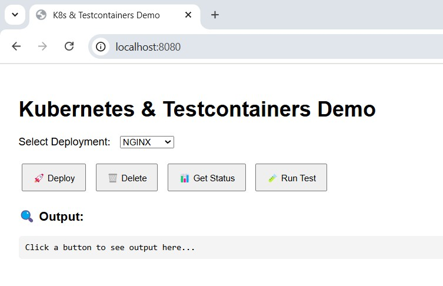

# 🚀 docker-k8s-testcontainers-demo

A live, hands-on demo that brings together **Kubernetes**, **Docker**, and **Testcontainers** to showcase how integration testing and deployment automation can be interactive, powerful, and developer-friendly.

> ✅ Build. 🚀 Deploy. 🧪 Test. All from a browser — powered by containers.

---

## 📌 What This Project Demonstrates

- 🔧 Deploying Kubernetes Pods dynamically using YAML manifests
- 🧪 Running integration tests using [Testcontainers](https://testcontainers.com/) for:
  - **NGINX**
  - **Redis**
  - **MongoDB** (with authentication)
- 🌐 Clean frontend UI to interact with deployments and see detailed test logs
- 🐳 Uses Docker Desktop and Testcontainers Desktop under the hood

---

## 🗂️ Project Structure

```
docker-k8s-testcontainers-demo/
├── backend/
│   ├── main.py                  # FastAPI backend
│   ├── test_nginx.py            # NGINX test using Testcontainers
│   ├── test_redis.py            # Redis test using Testcontainers
│   ├── test_mongodb.py          # MongoDB test with auth using Testcontainers
│   └── nginx-pod.yaml           # Sample Kubernetes pod YAML
│   └── redis-pod.yaml
│   └── mongodb-pod.yaml
│   └── Dockerfile
├── frontend/
│   └── index.html               # Interactive UI to control deployments and run tests
│   └── Dockerfile
├── docker-compose.yml
├── README.md
```

---

## ⚙️ Prerequisites

- ✅ Docker Desktop (with Kubernetes enabled)
- ✅ Python 3.10+
- ✅ Testcontainers Desktop ([Download](https://testcontainers.com/desktop/))
- ✅ `kubectl` CLI configured and working
- ✅ `pip install -r requirements.txt` (Install FastAPI, requests, pymongo, testcontainers, etc.)

---

## 🚀 How to Run the Project

### 1. Clone the Repository

```bash
git clone https://github.com/vellankikoti/docker-k8s-testcontainers-demo.git
cd docker-k8s-testcontainers-demo
```

### 2. Start the App with Docker Compose

```bash
docker-compose up --build
```

This will:
- Launch the **FastAPI** backend on `localhost:5000`
- Serve the frontend on `localhost:8080`

---

## 🌐 Access the Demo UI

Open your browser and go to:

```
http://localhost:8080
```

You can now:
- ✅ Select a deployment (NGINX, Redis, MongoDB)
- 🚀 Deploy or delete the pod using Kubernetes
- 📊 Check pod status
- 🧪 Run integration tests using Testcontainers (and view live logs!)

---

## 📸 Example UI (Screenshot Placeholder)

<p align="center">
  
</p>

---

## 🧪 Sample Test Output

```
🧪 Test Output for Redis:
🔧 Starting Redis Test using Testcontainers...
🚀 Redis container started.
🌐 Attempting to connect to Redis at redis://172.17.0.2:6379
✅ Redis is working fine, test passed!
📦 Container stopped and removed.
```

---

## 🛠️ Tips & Notes

- Make sure your Docker Desktop is running.
- Testcontainers Desktop should be logged in (required for stable container networking).
- MongoDB test uses a secured instance (`testuser/testpass`) — ensure it's reflected in both your test and URI.

---

## 🙌 Acknowledgements

- [FastAPI](https://fastapi.tiangolo.com/)
- [Testcontainers Python](https://pypi.org/project/testcontainers/)
- [Docker](https://www.docker.com/)
- [Kubernetes](https://kubernetes.io/)

---

## 📄 License

MIT © 2025

---

## ❤️ Like this demo?

Feel free to ⭐ star the repo and share your feedback!
```

---
